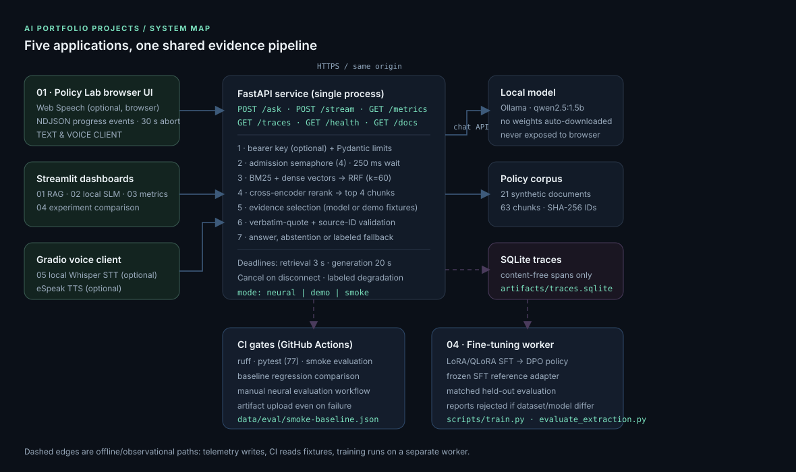

# AI Portfolio Projects

Five connected, runnable AI engineering projects — retrieval, local inference, observability, model adaptation and real-time interaction — built as one monorepo on an **employee policy assistant** domain with synthetic documents.

[](https://github.com/Devendra-Pudi/demoproject/actions/workflows/ci.yml)
[](pyproject.toml)
[](LICENSE)
[](https://devendra-pudi.github.io/demoproject/)

**What this is:** evidence-first RAG (hybrid retrieval → RRF → cross-encoder → citation-locked answering), a local SLM app with a same-host three-model benchmark, content-free request telemetry with regression gates, LoRA/DPO fine-tuning with matched held-out comparison, and a voice/text streaming client. **What it is not:** a hardened enterprise deployment, and not a claim of results that were never measured — every number below says where it came from.

## See it working

| | Project | What it proves | 60-second start |
|---|---|---|---|
| 01 | **Production-pattern RAG** | Hybrid retrieval + RRF + cross-encoder, with answers that can only be verbatim quotes from retrieved evidence | `RETRIEVAL_MODE=demo uvicorn ai_portfolio.api:app --port 8000` |
| 02 | **Local SLM with Ollama** | Offline inference plus a same-hardware three-model speed/quality benchmark | `python -m ai_portfolio.local 'Why do security keys resist phishing?'` |
| 03 | **Monitoring & observability** | Content-free SQLite spans, p50/p95, cost estimation, CI regression gates | `pytest tests/test_evaluation.py -q` |
| 04 | **LoRA & DPO fine-tuning** | JSON extraction adapters with a frozen SFT reference and held-out before/after comparison | `python scripts/evaluate_extraction.py --output artifacts/base.json` |
| 05 | **Real-time multimodal** | Browser voice/text, NDJSON progress stream, deadlines and labeled text fallback | `python projects/realtime-multimodal/app.py` |

Interface previews: [`docs/previews/`](docs/previews) · System diagram: [`docs/architecture.svg`](docs/architecture.svg) · Deployment: [DEPLOYMENT.md](DEPLOYMENT.md) · Portfolio directory: [devendra-pudi.github.io/demoproject](https://devendra-pudi.github.io/demoproject/)

> **Live application URLs are not claimed yet.** This repository ships runnable code, containers and a deployment guide; hosting the services (Streamlit/Gradio/API) requires an operator account. The GitHub Pages site publishes the project directory, not the Python apps. When a deployment exists, its HTTPS URL goes into `site/projects.json`.

## Quick start (no model downloads required)

Python 3.11+; run every command from the repository root.

```bash
python -m venv .venv && source .venv/bin/activate
pip install -r requirements-ci.txt && pip install --no-deps -e .
pytest -q                                                   # 87 tests
ai-eval --mode smoke --baseline data/eval/smoke-baseline.json  # deterministic gate

# Flagship app with zero model downloads: curated answers, re-validated against real retrieved text
RETRIEVAL_MODE=demo uvicorn ai_portfolio.api:app --host 0.0.0.0 --port 8000
```

Open port 8000 for the browser UI (`/docs` for the OpenAPI schema). Add the dashboards with:

```bash
pip install -r requirements-apps.txt -r projects/realtime-multimodal/requirements.txt
streamlit run projects/production-rag-application/app.py --server.port 8501
```

### Answer modes

| `RETRIEVAL_MODE` | Retrieval | Answer source | Honest label in UI |
|---|---|---|---|
| `neural` (default) | MiniLM embeddings + BM25 → RRF → cross-encoder | Local Ollama model, citation-validated | *NEURAL · hybrid + cross-encoder* |
| `demo` | Same code path with lexical test doubles | Curated fixtures in `src/ai_portfolio/demo.py`, re-checked against retrieved chunks | *DEMO · curated answers + lexical retrieval* |
| `smoke` | Lexical hash vectors and an overlap reranker | No generation — retrieval-only fallback | *SMOKE · lexical test doubles* |

Demo mode exists so the portfolio can be evaluated without a GPU or a model download. It is **not** a language model: a question outside the curated set returns evidence only, with the reason shown. Every demo quote must still be an exact substring of the retrieved document chunk, enforced by the same `enforce_citations()` used on live model output — and `tests/test_demo.py` fails if a curated quote stops matching the shipped documents.

## Full neural RAG

Install [Ollama](https://ollama.com/) separately, start its service, then:

```bash
pip install -e '.[retrieval]'
ollama pull qwen2.5:1.5b
RETRIEVAL_MODE=neural OLLAMA_MODEL=qwen2.5:1.5b \
  uvicorn ai_portfolio.api:app --host 0.0.0.0 --port 8000
ai-eval --mode neural --generate --output artifacts/full-rag-eval.json
```

First neural startup downloads `sentence-transformers/all-MiniLM-L6-v2` and `cross-encoder/ms-marco-MiniLM-L-6-v2`. After caching weights, set `HF_HUB_OFFLINE=1` and `TRANSFORMERS_OFFLINE=1` for disconnected execution. Model licenses and hardware requirements are separate from this source repository.

## Architecture



```text
Browser text / speech → FastAPI /stream → bounded request admission
                                        → BM25 + dense → RRF → cross-encoder
                                        → demo fixtures (labeled) or local Ollama selection
                                        → exact-quote + source-ID validation
                                        → answer / retrieval-only fallback
                       each request → SQLite content-free spans → /metrics
JSON fixtures → CI gates / neural evaluation / model benchmarks
Contact data → LoRA SFT → DPO against SFT reference → held-out comparison
```

API: `GET /health`, `POST /ask`, `POST /stream`, `GET /metrics`, `GET /traces`; schema at `/docs`. Browser fetches use same-origin relative URLs, including proxied previews.

```bash
curl -s http://localhost:8000/ask -H 'Content-Type: application/json' \
  -d '{"question":"When must production API keys be rotated?"}'
# {"status":"ok","generation_mode":"demo","answer":"Production API keys must be rotated every 90 days. [1]", ...}
```

## Measured evidence

| Check | Command | Result |
|---|---|---|
| Lint | `ruff check .` | Passed |
| Tests | `pytest -q` | **87 passed** (includes Streamlit `AppTest` and Gradio contract tests) |
| Deterministic retrieval gate | `ai-eval --mode smoke --baseline data/eval/smoke-baseline.json` | Passed — Recall@4 **1.0**, MRR **0.964**, citation invariants **1.0** over **18** fixtures (14 answerable, 4 abstention), retrieval p95 **0.47 ms** |
| Corpus | `ai-eval` | **21** synthetic policy documents → **63** chunks |
| Citation rejection | `pytest tests/test_rag.py -q` | Unknown chunk IDs, altered quotes and extra fields are refused |
| Live HTTP | `uvicorn` + `curl` | `/health`, `/ask`, `/stream` (NDJSON stages + answer), `/metrics`, `/` all confirmed working |
| CI | GitHub Actions | Reliability gates and Pages deploy: passing |

These are small-fixture, single-machine numbers from lexical test doubles in smoke mode — they show the gates work, not production quality. Neural retrieval, three-model benchmarks, GPU training and browser audio were **not** run here; see [VALIDATION.md](VALIDATION.md) for the full record of what was and was not executed.

Dashboards 02–04 deliberately ship **no sample results**: until you run the documented command and upload its report, they explain what the table will contain. Nothing in this repository is a stand-in for a measurement you can be asked to defend.

## Repository layout

```text
projects/
├── production-rag-application/   # Streamlit evidence UI + FastAPI Dockerfile
├── local-slm-ollama/             # Streamlit local assistant + benchmark viewer
├── monitoring-observability/     # Streamlit telemetry + evaluation gate viewer
├── lora-dpo-fine-tuning/         # Streamlit experiment/report comparison
└── realtime-multimodal/          # Gradio voice/text + optional local STT/TTS
src/ai_portfolio/                 # shared retrieval, RAG, telemetry, evaluation, demo fixtures
data/                             # synthetic policy documents, eval fixtures, training fixtures
site/                             # GitHub Pages portfolio directory
docs/                             # architecture diagram, interface previews, capture script
```

Each project folder ships its own `app.py`, `requirements.txt`, `Dockerfile` and `README.md`; reusable logic stays in `src/ai_portfolio`. Build from the repository root — see [DEPLOYMENT.md](DEPLOYMENT.md) for Streamlit Community Cloud, Docker Compose and Hugging Face Spaces.

## Configuration

| Variable | Default | Purpose |
|---|---|---|
| `API_KEY` | unset (local only) | Shared service bearer key; set for remote backend deployments |
| `RETRIEVAL_MODE` | `neural` | `neural`, `demo` (curated, labeled) or `smoke` (labeled test doubles) |
| `OLLAMA_URL` | `http://127.0.0.1:11434` | Server-side inference address; never sent to browser |
| `OLLAMA_MODEL` | `qwen2.5:1.5b` | Installed Ollama model |
| `TRACE_DB` | `artifacts/traces.sqlite` | Content-free local trace database |
| `RETRIEVAL_TIMEOUT_S` | `3` | Retrieval response deadline |
| `GENERATION_TIMEOUT_S` | `20` | Generation/validation response deadline |
| `INPUT_USD_PER_MILLION` | `0` | Estimated input API token price |
| `OUTPUT_USD_PER_MILLION` | `0` | Estimated output API token price |
| `ENABLE_LOCAL_STT` | `0` (Docker image: `1`) | Local transcription in project 05; the image ships faster-whisper + eSpeak |

API requires restarting to reindex document changes. Defaults suit a small single-process deployment. Environment variables are server configuration, not user-editable API inputs. `/metrics` reports a `generation_modes` breakdown (`demo` / `model` / `unavailable`) so curated answers can never be mistaken for model output.

## Limits and deployment checklist

- Evidence-first design: quotes prove provenance, **not relevance or completeness**. The evidence-selection model may pick irrelevant quotes. Note also that retrieval here uses light plural normalization rather than full stemming.
- Optional shared bearer-key protection is available via `API_KEY` (all backend routes except `/health`). There is no per-user authentication, tenant isolation, ACL-filtered retrieval, per-identity rate limiting or TLS termination. `/traces` and `/metrics` need access control before any sensitive deployment.
- SQLite traces have no retention/rotation, cross-service propagation or OpenTelemetry export. Questions and documents are not recorded in traces; benchmark artifacts do contain model outputs.
- In-memory exact dense search suits small corpora. Large deployments need persisted indexes, approximate nearest neighbours, incremental updates and document-level ACLs.
- Python deadlines stop waiting, not native CPU/GPU kernels; hard cancellation needs worker-process isolation. Browser speech engines may use third-party services, so voice is **not guaranteed offline**.
- Training data is deliberately small and synthetic (12 SFT examples, 12 preference pairs, 6 held-out). Expand it and reserve independent validation/test splits before asserting generalization or meaningful fine-tuning gains.
- Model weights, checkpoints, traces and generated reports live in ignored directories. No secrets or model binaries are committed.

## Interface previews and screenshots

`docs/previews/*.svg` are hand-drawn **layout previews** — they show structure, not pixels, and are labeled as such. To capture real screenshots from the running apps:

```bash
pip install playwright && playwright install chromium
python scripts/capture_screenshots.py            # writes docs/screenshots/*.png
```

The capture script starts each app, screenshots it, and shuts it down; it skips cleanly when no browser is installed.
